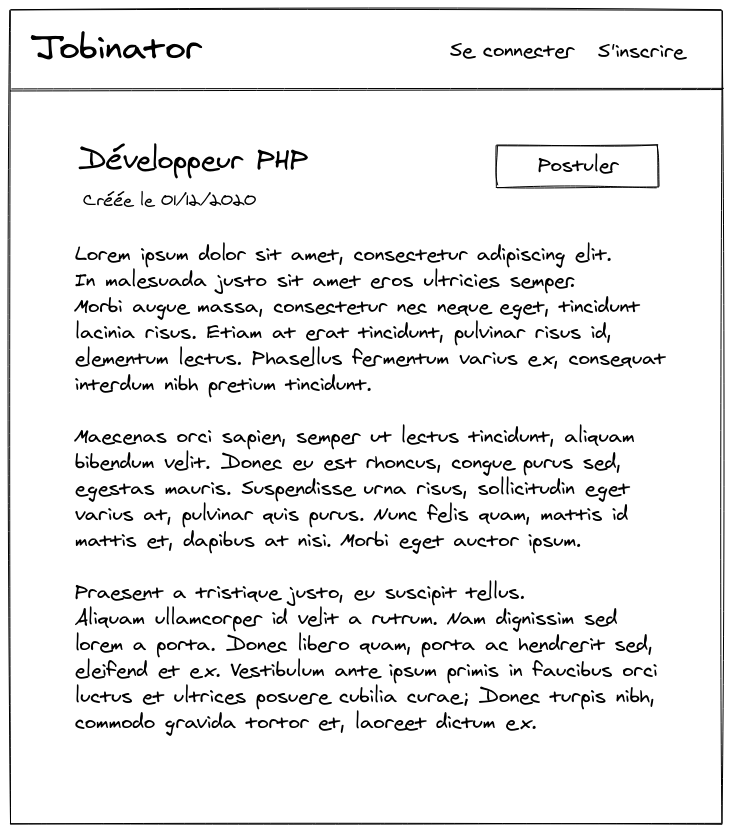
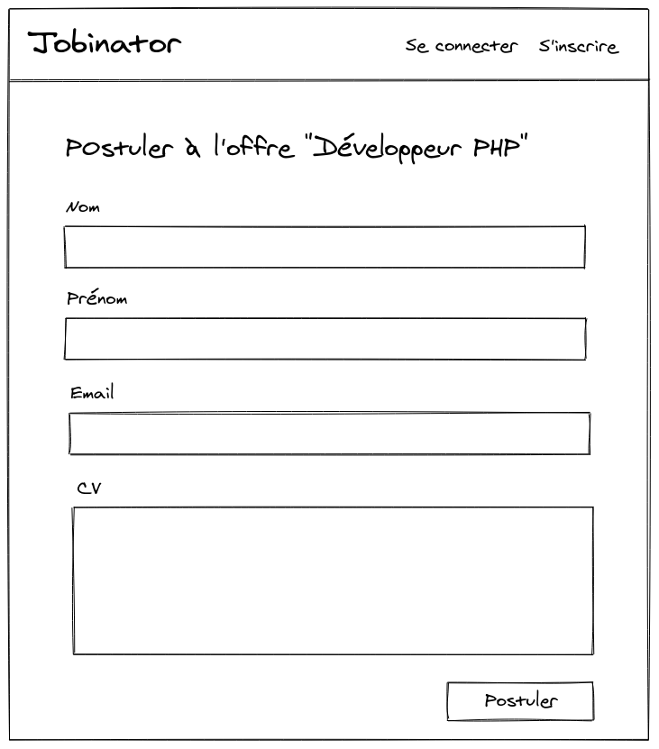

# TP test - 08/03/2023

## Consignes

Vous avez 4 heures pour ajouter les fonctionnalités décrites ci-dessous à l'application "Jobinator", un site d'offres d'emploi.

Jobinator est un site de publication d'offres d'emploi classique :
un internaute peut s'inscrire sur le site pour gérer ses offres d'emploi et une fois publiées,
les annonces sont accessibles publiquement aux internautes.

L'interface du site devra **respecter les croquis fournis** et être **traduite intégralement en français**.

**Toutes les fonctionnalités devront être accompagnées de tests fonctionnels.**

Si nécessaire, vous pouvez retrouver le détail du fonctionnel de l'application sur le [précédent TP noté](https://iut-info.univ-reims.fr/gitlab/symfony/wimsi-2023/tp1-jobinator/-/blob/main/README.md).

## Critères d'évaluation

### Principaux critères

1. Respect du fonctionnel
2. Qualité des tests
3. Respect des bonnes pratiques
4. Respect des croquis fournis

### Autre critère

* Commits bien découpés

## Fonctionnel

Vocabulaire :

* Internaute : désigne une personne non connectée
* Utilisateur : désigne une personne possédant un compte utilisateur et qui est authentifiée sur le site Jobinator

### Utiliser des Voters

Remplacez les contrôles d'accès existants sur les actions `edit`, `delete` et `show` par un `Voter`.

Exemple : lors de l'édition d'une offre, la vérification que l'utilisateur est bien le propriétaire de l'offre devra
être faite sous la forme d'un `Voter`.

### Déposer une candidature

En tant qu'**internaute**, je souhaite pouvoir déposer une candidature pour une annonce publiée.
Lorsque je suis sur la page de consultation d'une offre d'emploi et que je clique sur le bouton "Postuler",
on me demande de remplir un formulaire comportant les champs suivants :

- nom (obligatoire et non vide)
- prénom (obligatoire et non vide)
- email (obligatoire et email valide)
- CV (obligatoire et doit contenir au moins 100 caractères)

Une fois le formulaire rempli, je clique sur le bouton "Postuler" et l'email suivant est envoyé au propriétaire de l'annonce :

- Sujet : Nouvelle candidature
- Contenu :

```
Bonjour,

Vous avez reçu une nouvelle réponse à votre offre <titre de l'offre> :

Nom : <nom du postulant>
Prénom : <prénom du postulant>
Email : <email du postulant>

<CV>

Cordialement,

L'équipe Jobinator.
```

Les données ne sont pas conservées, elles sont uniquement utilisées pour envoyer l'email.
Une fois l'email envoyé, l'internaute est ensuite redirigé sur la page de consultation de l'offre d'emploi.

**La fonctionnalité doit être testée.**

<p align="center">
    
    
</p>

### Commande d'export des offres d'emploi en CSV

En tant qu'administrateur d'une instance de Jobinator, je souhaite pouvoir exporter la totalité des offres d'emploi du site
sous forme de CSV directement en ligne de commande.

La commande doit avoir la signature suivante :

```shell
app:export-jobs [--since=<date au format YYYY-MM-DD, ex : 2021-03-24>]
```

Le fichier CSV généré devra contenir les colonnes suivantes :

- title
- owner (email)
- createdAt
- published
- description

Exemple de fichier :

```csv
title,owner.email,createdAt,published,description
DevOps,contact@floran.fr,2021-03-21T22:19:14+00:00,1,"Lorem ipsum dolor sit amet, consectetur adipiscing elit. Duis elementum mi vel consequat ultricies. Donec id blandit arcu. Nulla facilisi. Cras a mi nec nulla auctor dignissim. Curabitur vel lectus at dolor mattis lobortis eget ut quam. Nam finibus at est eu facilisis.
"Développeur fullstack Symfony",contact@nclshart.net,2021-03-21T22:19:14+00:00,1," Lorem ipsum dolor sit amet, consectetur adipiscing elit. Donec facilisis posuere libero, a dapibus dolor blandit et. Suspendisse egestas risus ac efficitur malesuada. Vivamus condimentum vehicula semper. Cras eu commodo mi.
```

Pour générer ce fichier, vous devrez utiliser le `Serializer` de Symfony.

Conditions d'acceptation :

- le nom de la commande est `app:export-jobs`
- l'ordre des colonnes du CSV doit être respecté
- la commande possède une option `since` qui permet de filtrer les offres en sélectionnant uniquement les offres créées à partir de cette date (incluse)
- le fichier CSV doit être généré dans le répertoire `var` du projet
- le fichier généré doit être nommé `export_<date du jour au format YYYY-MM-DD>.csv`, exemple : `export_2021-03-24.csv`
- le fichier est généré uniquement s'il contient au moins une offre

Aide pour les tests fonctionnels :

De la même façon que la base de données est réinitialisée entre chaque test,
le fichier généré par la commande devra être supprimé entre chaque test afin d'éviter les interférences.
Pour cela, vous devrez utiliser la méthode [tearDown](https://phpunit.readthedocs.io/en/latest/fixtures.html?highlight=tearDown#fixtures) de PHPUnit.

## Ressources

* [Slides du cours](https://slides-symfony-iut.netlify.com)
* [Projet Quote Machine](https://iut-info.univ-reims.fr/gitlab/symfony/wimsi-2023/quote-machine)
* [Demo Symfony](https://github.com/symfony/demo)
* [Documentation Symfony](https://symfony.com/doc/5.4/index.html)
